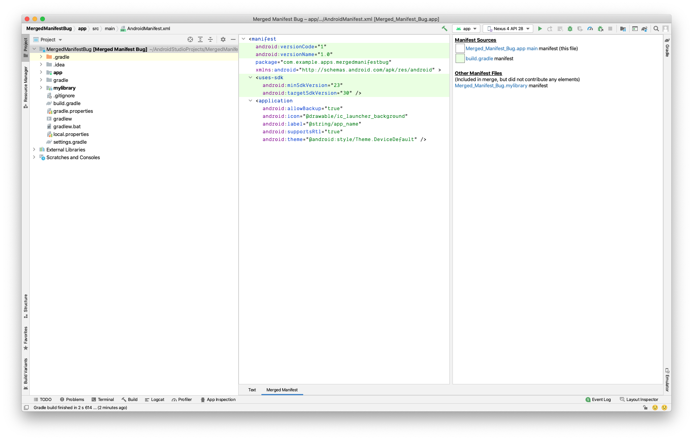

# Merged Manifest Bug

This project illustrates the bug in Android Studio where Merged Manifest doesn't show contributions
from transitive dependencies.

The `app` module depends on `mylibrary` which in turn depends on Work Manager. Work Manager has
several components added to the `AndroidManifest.xml` file including permissions, Content Providers,
Services and Broadcast Receivers. However, as seen in the screenshot, none of those are visible in
the merged manifest view for the app's `AndroidManifest.xml`.

See Work Manager's [AndroidManifest.xml](https://github.com/androidx/androidx/blob/b23b43bd57ec697a29e5c93c6c93a651e49dcf64/work/workmanager/src/main/AndroidManifest.xml) 
here. None of these elements are visible in the screenshot above.

If the work manager dependency is added to the app module, the merged manifest view works correctly.

## Impact

The issue can lead to unwanted permissions sneaking into the application when some dependencies are
updated. Some permissions like background location and read sms, may be added by certain libraries
and go unnoticed. This can lead to Play Store rejection.
